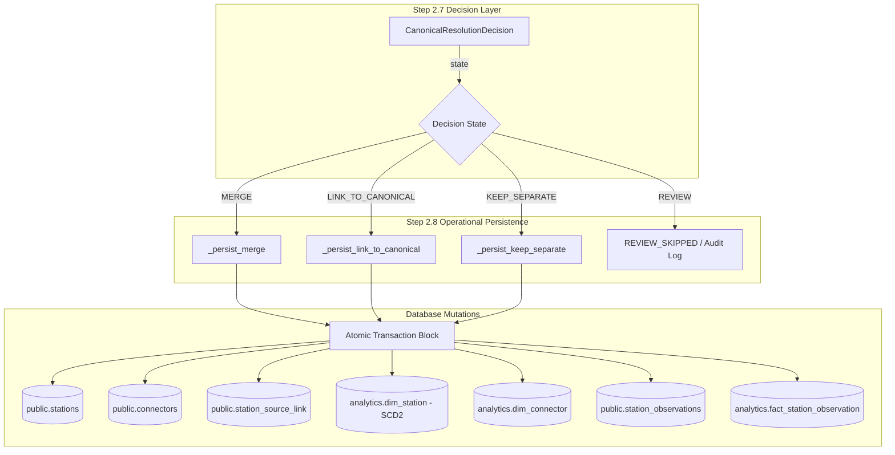

# ChargePlus — Phase 2, Step 2.8: Canonical Operational Loading & Mutation Isolation

> **Core Architectural Rule**:  
> **"Step 2.7 decides. Step 2.8 persists."**  
> **"Step 2.8 does not independently perform entity resolution."**

---

## 1. Purpose & Architectural Boundary

Step 2.7 produced the authoritative in-memory canonical decisions (`CanonicalResolutionDecision`) governing cross-source deduplication, entity clustering, and field-level survivorship.  
**Step 2.8 is strictly responsible for safely, idempotently, and transactionally applying those authoritative decisions to the operational PostgreSQL database (`public.*`) and conformed analytical warehouse tables (`analytics.*`).**

### Layered Ingestion Boundary

| Step | Layer Responsibilities |
| :--- | :--- |
| **Step 2.4** | Resolve cross-source identity evidence (probabilistic pairwise similarity, spatial geodetic matching, blocking). |
| **Step 2.5** | Normalize fields into standardized vocabulary (ISO/IEC standards, SI units, Indian PIN regex, uppercase acronyms). |
| **Step 2.6** | Validate data quality and quarantine anomalies (`ACCEPT`, `ACCEPT_WITH_WARNINGS`, `QUARANTINE`, `REJECT`). |
| **Step 2.7** | Decide canonical identity, cluster topology, and field survivorship (`MERGE`, `LINK_TO_CANONICAL`, `KEEP_SEPARATE`, `REVIEW`). |
| **Step 2.8** | **Persist canonical operational state transactionally and idempotently into `public.*` and `analytics.*`.** |
| **Step 2.9** | Freshness scoring, observation age decay, and staleness monitoring (LOCKED — do NOT implement in Step 2.8). |

---

## 2. Input Decision Model

The operational persistence layer receives verified `CanonicalResolutionDecision` objects produced by `CanonicalDeduplicationEngine`. Step 2.8 never recomputes matching scores, never clusters records, and never re-derives survivorship values.



---

## 3. Decision-Specific Persistence Semantics

### 3.1 `MERGE` Behavior
- **Target**: Multiple disparate source records resolved into a single physical location.
- **Station Creation/Update**:
  - If no canonical station exists, creates **exactly one** new canonical station row with a newly generated ChargePlus UUID.
  - If a participating source record already has an existing canonical link, reuses that established UUID.
  - Applies survivorship-selected station attributes (`name`, `latitude`, `longitude`, `operator_id`, `address_line`, `locality`, `city`, `state`, `postal_code`, `country`, `is_24_hours`, `opening_time`, `closing_time`, `operational_status`, `access_type`, `is_public`, `phone`, `website_url`).
- **Source Links**:
  - Persists idempotent bridges in `public.station_source_link` for **every** participating source record.
- **Connectors**:
  - Persists conformed capacity groups reconciled across sources without blind summing.

### 3.2 `LINK_TO_CANONICAL` Behavior
- **Target**: An incoming source record links as additional evidence to an established canonical station.
- **Station Identity Preservation**:
  - Strictly preserves the established canonical station UUID (`decision.canonical_station_id`). Never creates a second station row.
- **Survivorship Updates**:
  - Updates only fields where the incoming record has higher authority/survivorship precedence according to Step 2.7.
- **Source Link Persistence**:
  - Creates or updates the link in `public.station_source_link` pointing to the existing canonical station.

### 3.3 `KEEP_SEPARATE` Behavior
- **Target**: Distinct physical stations that must not be merged.
- **Idempotency**:
  - Checks `public.station_source_link` for an existing `(source_id, source_station_id)` bridge.
  - If `source_payload_hash` matches the previously ingested record, returns `CanonicalPersistenceStatus.UNCHANGED` with zero mutating SQL statements (merely bumps `last_seen_at = now()`).
  - If payload changed, updates the existing canonical station and returns `CanonicalPersistenceStatus.UPDATED`.
  - If first seen, creates one canonical station and returns `CanonicalPersistenceStatus.INSERTED`.
  - Running the same `KEEP_SEPARATE` payload multiple times **never creates duplicate stations**.

### 3.4 `REVIEW` Behavior
- **Target**: Ambiguous clusters or material field conflicts (e.g. conflicting coordinates > 50m, conflicting operator ownership, free vs. paid tariffs).
- **Zero Silent Mutation**:
  - **Zero rows** created or mutated in `public.stations`.
  - **Zero rows** created or mutated in `public.connectors`.
  - Returns `CanonicalPersistenceStatus.REVIEW_SKIPPED` with `is_review_skipped = True`.
  - Captures conflict details and reasons in `CanonicalPersistenceResult.details` for auditing.

---

## 4. Operational Table Mutation Rules

### 4.1 Canonical Station Identity (`public.stations`)
- **ChargePlus UUID**: Canonical station IDs are system-generated UUIDv4 values belonging exclusively to ChargePlus. External provider IDs (OCM ID, OSM node/way, CPO IDs) are **never** used as primary keys.
- **Missing != Conflict**:
  - When an incoming payload omits an optional field (`None`, empty string, or `"unknown"`), existing non-null canonical attributes are **never erased**.
  - Enforced via SQL `COALESCE(%s, existing_column)` and conditional status evaluation:
    ```sql
    UPDATE public.stations SET
        operator_id = COALESCE(%s, operator_id),
        address_line = COALESCE(%s, address_line),
        postal_code = COALESCE(%s, postal_code),
        operational_status = CASE WHEN %s != 'unknown' THEN %s ELSE operational_status END,
        updated_at = now()
    WHERE id = %s;
    ```
- **Operating Hours Constraint**:
  - If `is_24_hours = True`, `opening_time` and `closing_time` are explicitly cleared to `NULL` to strictly honor check constraint `chk_stations_hours` (`(is_24_hours = true AND opening_time IS NULL AND closing_time IS NULL) OR ...`).

### 4.2 Connector Reconcilation (`public.connectors`)
- **Capacity Group Natural Key**:
  - In public.connectors, physical equipment is identified by `(station_id, connector_type, power_kw, charging_standard)` to satisfy database unique constraint `uq_connectors_station_type_power`.
- **Step 2.7 Decides, Step 2.8 Persists**:
  - The persistence layer persists the exact quantity selected by Step 2.7's field survivorship decision. It does **not** independently apply `max(existing, incoming)` over explicit Step 2.7 decisions.
  - If existing canonical quantity is 4 and Step 2.7 explicitly decides 2 (e.g. verified survey revision or equipment decommissioning), the loader persists 2 without overriding Step 2.7.
  - Cross-source inventory deduplication and intra-source plug summation are performed by Step 2.7; Step 2.8 applies that authoritative decision without recomputing or inventing survivorship.
- **No Deletion on Omission**:
  - If an incoming source payload reports only CCS2 connectors, existing Type 2 connectors at the station are **retained intact**. Source omission is not proof of physical removal. Unmentioned capacity groups in `public.connectors` are never deleted.

### 4.3 Source Link Provenance (`public.station_source_link`)
- Bridges external source IDs to canonical ChargePlus station UUIDs:
  - `(source_id, source_station_id)` unique constraint `uq_station_source_link_source_record`.
- **Race Safety & Idempotency**:
  - Existing link matching the same station updates `last_seen_at = now()`, `last_ingested_at = now()`, and `source_payload_hash`.
- **Identity Reassignment Protection**:
  - If an incoming record attempts to bind an external `(source_id, source_station_id)` to a *different* canonical station UUID, persistence immediately **aborts and rolls back** with an explicit `Unsafe identity mutation` error.

---

## 5. Conformed Warehouse Dimensions & SCD2

### 5.1 `analytics.dim_station` (Slowly Changing Dimension Type 2)
The warehouse dim_station table tracks canonical attribute history via SCD Type 2:
- Tracked attributes: `station_name`, `operator_key`, `location_key`, `latitude`, `longitude`, `address`, `access_type`, `is_public`, `operational_status`, `is_24_hours`, `opening_time`, `closing_time`.
- **Unchanged attributes**: Idempotently returns existing `station_key` without creating new rows.
- **Changed tracked attributes**:
  1. Closes the currently active version:
     ```sql
     UPDATE analytics.dim_station
     SET is_current = false, effective_to = now(), updated_at = now()
     WHERE station_key = %s;
     ```
  2. Inserts a new active version with `version = old_version + 1`, `effective_from = now()`, `is_current = true`.

### 5.2 Conformed Auxiliary Dimensions
- `analytics.dim_operator`: Looked up by `operator_id` or inserted deterministically.
- `analytics.dim_location`: Looked up by conformed hierarchy `(country, state, city, locality, postal_code)`.
- `analytics.dim_connector`: Mirrors operational equipment with Fast Charging categorization (`power_kw >= 50.0`).
- `analytics.dim_source`: Mirrors registered external data sources.

---

## 6. Time-Series Observations & Decoupling

Telemetry availability observations belong strictly to time-series history (`public.station_observations` and `analytics.fact_station_observation`), decoupled from static station identity.
- Persisted only if `rec.observation is not None`.
- **Static Status Isolation**: Static `StatusTypeID = 50` ("Operational") is mapped to `public.stations.operational_status = 'operational'`, **never** fabricated into a fake live connector availability observation.
- **Observation Idempotency**: Evaluates `source_payload_hash` against `public.station_observations`. Duplicate telemetry payloads are skipped idempotently.

---

## 7. Transaction Isolation & Error Handling

- **Transaction Boundary**:
  - Each `persist_canonical_decision` invocation operates within an isolated database transaction block.
  - Sub-operations (`get_or_create_operator`, `get_or_create_data_source`, `_ensure_dim_source`) accept `commit=False` when invoked inside canonical loading, ensuring no premature mid-transaction commits.
  - On any unhandled SQL error or constraint violation:
    1. Entire transaction is rolled back via `self.conn.rollback()`.
    2. Zero partial state is written (no station without connectors; no station without source links).
    3. Errors are sanitized via `_scrub_secrets` (scrubbing API keys, tokens, and passwords).
    4. Structured `CanonicalPersistenceResult(status=FAILED, error=...)` is returned.
- **Batch Isolation**:
  - `persist_canonical_batch` isolates transactions per decision. A single invalid cluster in a batch of 100 will fail and roll back without corrupting the other 99 decisions.

---

## 8. Verification & Quality Gates

The test suite [`tests/test_canonical_operational_loading.py`](file:///c:/Users/Admin/Desktop/Projects/ChargePlus/tests/test_canonical_operational_loading.py) provides 43 automated tests across 12 requirement sections:

```bash
python -m pytest tests/ -v
# Result: 219 passed in 10.46s (100% passing)

npx tsc --noEmit
# Result: 0 errors (100% clean)

npm run lint
# Result: 0 lint errors (100% clean)

npm run build
# Result: Turbopack production build succeeded (0 errors)
```

Live database integration test 37 verified live Supabase PostgreSQL execution within a transaction and executed clean rollback, leaving baseline production station count intact at exactly 2 rows.

---

## 9. Boundary with Step 2.9

- **Step 2.8 Scope**: Canonical operational loading, station/connector reconciliation, source-link provenance, SCD2 dimension synchronization, transaction rollback, and mutation isolation.
- **Step 2.9 (Next Step)**: Freshness decay scoring, time-decay curves, and staleness classification. Step 2.8 does not calculate staleness or freshness degradation.
