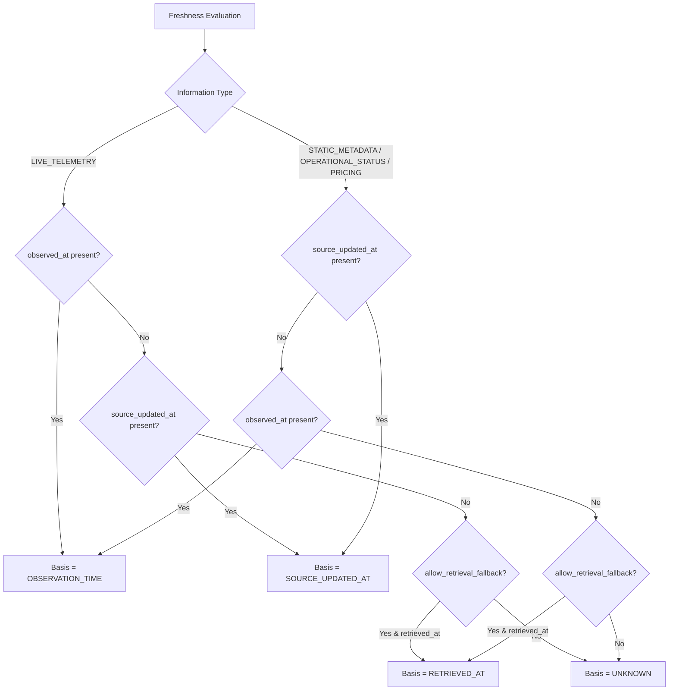

# ChargePlus — Phase 2, Step 2.9: Freshness Engine, Observation Provenance & Staleness Decay

> **Core Architectural Principles**:  
> **"STALE != UNAVAILABLE"** — An old observation remains historical evidence; it is never rewritten into unavailable merely because it became stale.  
> **"UNKNOWN FRESHNESS != UNAVAILABLE"** — Missing freshness or timestamps never imply that a charger is unavailable.  
> **"MISSING TIMESTAMP != CURRENT"** — Missing timestamps are never defaulted to `datetime.now()` or assumed to be fresh.  
> **"STATION METADATA FRESHNESS != LIVE OBSERVATION FRESHNESS"** — Static site identity and dynamic connector telemetry have distinct update cadences and are evaluated independently.

---

## 1. Purpose & Architectural Scope

Step 2.9 implements the authoritative ChargePlus Freshness and Observation Provenance Engine ([`backend/ingestion/freshness.py`](file:///c:/Users/Admin/Desktop/Projects/ChargePlus/backend/ingestion/freshness.py)).

The system answers these fundamental operational questions:
- **When was this information observed?** (Authentic event/telemetry timestamp).
- **When did the source say it was updated?** (Upstream record timestamp).
- **When did ChargePlus retrieve it?** (Adapter fetch timestamp).
- **Which source record produced it?** (Source ID and source station/record key).
- **What payload/version produced it?** (SHA-256 payload hash and contract version `1.0.0`).
- **How old is the information relative to a supplied reference time?** (Transparent age in seconds/minutes).
- **Is it fresh, aging, stale, or unknown under the applicable policy?** (Categorical freshness classification).
- **What is the freshness basis?** (The authoritative timestamp field selected for evaluation).
- **Has the information become stale without claiming that the station is unavailable?** (Preservation of historical availability).

### Layered Architecture Boundary

| Step | Layer Responsibilities |
| :--- | :--- |
| **Step 2.6** | Validate data quality and quarantine anomalies (`ACCEPT`, `ACCEPT_WITH_WARNINGS`, `QUARANTINE`, `REJECT`). |
| **Step 2.7** | Decide canonical identity, cluster topology, and field survivorship (`MERGE`, `LINK_TO_CANONICAL`, `KEEP_SEPARATE`, `REVIEW`). |
| **Step 2.8** | Persist canonical operational state transactionally into `public.*` and `analytics.*`. |
| **Step 2.9** | **Evaluate temporal freshness, calculate staleness decay, preserve observation provenance, and enforce `STALE != UNAVAILABLE`.** |
| **Step 2.10**| Scheduled ingestion, polling daemons, cron triggers, retry/backoff policies (LOCKED — not in Step 2.9). |
| **Step 2.11**| Mumbai coverage spatial auditing, missing-field rates, and Phase 2 sign-off (LOCKED — not in Step 2.9). |

---

## 2. Freshness Terminology & Taxonomy

The engine defines four discrete, unambiguous freshness states:

| Freshness State | Semantic Definition | Actionable Driver Meaning |
| :--- | :--- | :--- |
| `FRESH` | Information is within the applicable fresh window (e.g. $\le 5$ min for live telemetry). | Highly reliable for live routing and availability display. |
| `AGING` | Information has exceeded the fresh window but remains within allowable stale threshold (e.g. $5 - 15$ min). | Usable with visual recency indicator ("updated 8 min ago"). |
| `STALE` | Information has exceeded the stale threshold (e.g. $> 15$ min for live telemetry, $> 30$ days for static profile). | Historical evidence only; suppressed from live real-time claims. |
| `UNKNOWN` | Temporal relevance cannot be reliably established (missing or malformed timestamp, unresolvable basis). | Neutral handling; displays "Last update unknown", never "Unavailable". |

---

## 3. The Four Distinct Timestamps

ChargePlus enforces strict separation between four conceptually different timestamps. Collapsing these into a single column is an architectural anti-pattern.

```
Timeline:
------------------------------------------------------------------------------------> (Time)
  [A. Event Occurred]      [B. Source Updated]       [C. ChargePlus Fetched]    [D. Database Persisted]
   observed_at               source_updated_at        retrieved_at               created_at / ingested_at
   (e.g. 10:00:00 UTC)       (e.g. 10:00:05 UTC)      (e.g. 10:01:20 UTC)        (e.g. 10:01:21 UTC)
```

1. **A. Observation / Event Time (`observed_at`)**:  
   When the physical charger state or telemetry snapshot actually occurred in reality.
2. **B. Source Updated Time (`source_updated_at` / `source_timestamp`)**:  
   When the upstream provider (e.g. OpenChargeMap, CPO API) updated or published its record.
3. **C. Retrieval Time (`retrieved_at` / `retrieval_timestamp`)**:  
   When the ChargePlus ingestion adapter made the HTTP request and fetched the payload.
4. **D. Ingestion / Persistence Time (`created_at` / `last_ingested_at`)**:  
   When ChargePlus executed the database transaction and wrote the record.

---

## 4. Freshness Basis Selection

The freshness engine dynamically determines which timestamp is authoritative for each evaluation using explicit priority rules:



- **Live Telemetry**: Requires an authentic observation timestamp. Retrieval fallback is strictly disallowed by default (`allow_retrieval_fallback = False`).
- **Static Metadata**: Source updated timestamp is primary; retrieval timestamp is permitted as a documented fallback when upstream providers omit update headers.

---

## 5. Policy Abstraction (`FreshnessPolicy`)

Rather than hard-coding universal domain thresholds, ChargePlus utilizes a typed, configurable policy abstraction:

```python
class FreshnessPolicy(BaseModel):
    policy_id: str
    name: str
    description: str
    information_type: InformationType
    fresh_window_seconds: float
    stale_window_seconds: float
    allow_retrieval_fallback: bool = False
    future_skew_tolerance_seconds: float = 5.0
    decay_curve: DecayCurve = DecayCurve.NONE
    decay_half_life_seconds: Optional[float] = None
    min_decay_score: float = 0.0
    max_decay_score: float = 1.0
```

### ChargePlus Standard Default Policies

| Policy ID | Info Type | Fresh Window | Stale Window | Fallback Allowed | Decay Curve |
| :--- | :--- | :--- | :--- | :--- | :--- |
| `chargeplus_live_telemetry_v1` | `LIVE_TELEMETRY` | $\le 5$ min (300s) | $> 15$ min (900s) | No | `LINEAR` |
| `chargeplus_operational_status_v1` | `OPERATIONAL_STATUS` | $\le 1$ hour (3600s) | $> 24$ hours (86400s) | No | `LINEAR` |
| `chargeplus_static_metadata_v1` | `STATIC_METADATA` | $\le 7$ days (604800s) | $> 30$ days (2592000s) | Yes | `NONE` |
| `chargeplus_pricing_v1` | `PRICING` | $\le 24$ hours (86400s) | $> 7$ days (604800s) | No | `NONE` |

---

## 6. Mathematical Staleness Decay Curves

Transparent age in seconds is always preserved. When a continuous score $[0.0, 1.0]$ is required for downstream ranking or filtering, pluggable mathematical decay curves are evaluated:

1. **`NONE`**: No synthetic score; `decay_score = None`. Raw age is authoritative.
2. **`LINEAR`**:
   $$\text{score} = \max\left(0.0, \min\left(1.0, 1.0 - \frac{\text{age\_seconds}}{\text{stale\_window\_seconds}}\right)\right)$$
3. **`EXPONENTIAL`**:
   $$\text{score} = 2^{-\frac{\text{age\_seconds}}{\text{decay\_half\_life\_seconds}}} = e^{-\frac{\ln(2) \cdot \text{age\_seconds}}{\text{decay\_half\_life\_seconds}}}$$
4. **`STEP`**:
   - $1.0$ if $\text{age} \le \text{fresh\_window}$
   - $0.5$ if $\text{fresh\_window} < \text{age} \le \text{stale\_window}$
   - $0.0$ if $\text{age} > \text{stale\_window}$

---

## 7. Determinism & Zero Runtime Dependencies

- **Mandatory `as_of` Reference Time**:
  All `evaluate()` methods require an explicit `as_of: datetime`.
  ```python
  result = engine.evaluate(as_of=reference_datetime, observed_at=event_datetime)
  ```
- **Zero Hidden `datetime.now()`**: Pure functional execution.
- **Timezone Standardization**: All naive or foreign-timezone datetimes are normalized to UTC (`astimezone(timezone.utc)`) before interval arithmetic.

---

## 8. Defenses & Invariant Enforcements

### 8.1 STALE != UNAVAILABLE
If an observation reported `availability_status = AVAILABLE` 4 hours ago, its freshness state is `STALE`, but its `retained_status` remains `AVAILABLE`. It is never rewritten to `UNAVAILABLE` or `BROKEN`.

### 8.2 Future Timestamp Protection
If a timestamp is in the future beyond `future_skew_tolerance_seconds` (5.0s), the engine:
- Sets `is_future = True` and records `future_skew_seconds`.
- Evaluates `state = UNKNOWN` with `decay_score = 0.0`.
- Appends diagnostic warning to `warnings`.

### 8.3 Observation Freshness vs Entity Freshness
[`StationFreshnessSummary`](file:///c:/Users/Admin/Desktop/Projects/ChargePlus/backend/ingestion/freshness.py) evaluates metadata freshness and observation freshness independently. A station can have fresh metadata with stale observation, or fresh observation with older metadata.

---

## 9. Verification & Quality Gates

The test suite [`tests/test_freshness_provenance.py`](file:///c:/Users/Admin/Desktop/Projects/ChargePlus/tests/test_freshness_provenance.py) provides 33 unit and live integration tests covering all requirements A through Z:

```bash
python -m pytest tests/ -q
# Result: 252 passed in 17.29s (100% passing)

npm run typecheck
# Result: 0 errors (100% clean)

./node_modules/.bin/eslint src
# Result: 0 errors (100% clean)

npm run build
# Result: Turbopack production build succeeded across all 26 routes (0 errors)
```

Live database integration test 33 verified live Supabase PostgreSQL provenance tracking within an isolated transaction and executed clean rollback, preserving baseline database counts (exactly 2 stations, 1 observation, 0 test pollution).

---

## 10. Boundaries & Out-of-Scope Items

- **In Scope for Step 2.9**: Freshness calculation, policy abstraction, timestamp semantics, provenance preservation, staleness classification, and decay curves.
- **Out of Scope (Deferred to Step 2.10)**: Scheduled ingestion, polling daemons, cron schedules, retry/backoff policies.
- **Out of Scope (Deferred to Step 2.11)**: Mumbai coverage spatial auditing, missing-field rates, and final Phase 2 sign-off.
- **Out of Scope (Deferred to Phase 5)**: Machine learning predictive demand modeling and queue inference.
